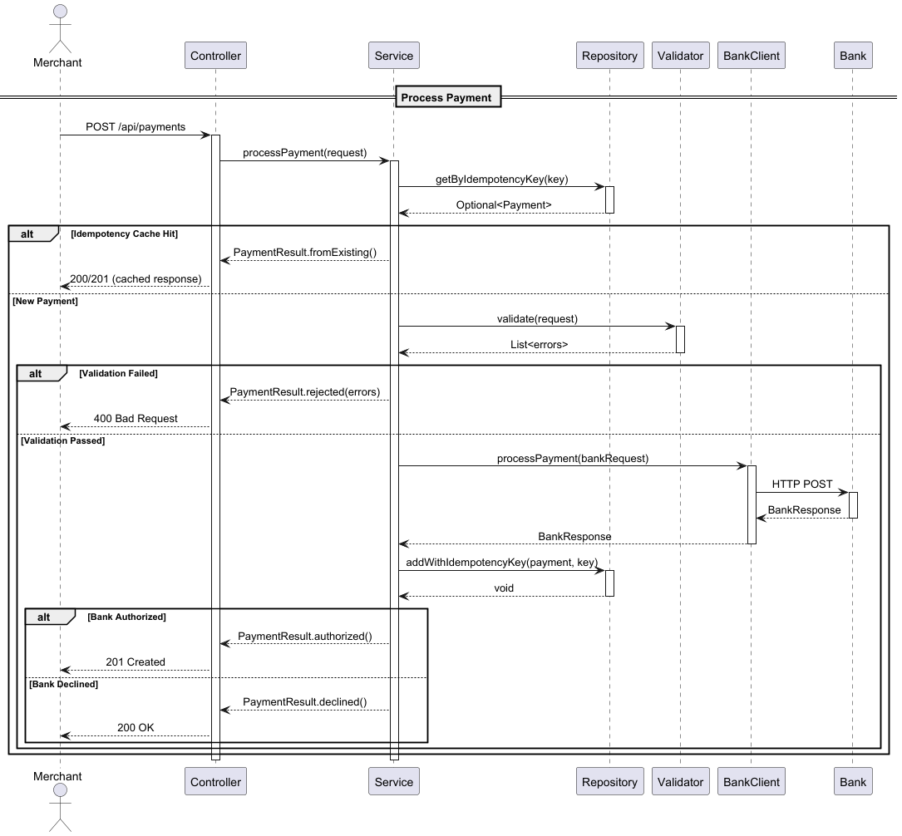

# Payment Gateway

A simple, maintainable Spring Boot implementation of the Checkout.com payment gateway challenge.
It focuses on correctness, clarity and meeting the functional requirements of the exercise, with a few optional enhancements called out separately.

## Quick Start

```bash
# Prerequisites: JDK 17, Docker

# Start bank simulator
docker-compose up -d

# Run application
./gradlew bootRun
```

- App: http://localhost:8090
- Swagger: http://localhost:8090/swagger-ui/index.html

---

## Scope & Assumptions

The following reflect the expectations outlined in the challenge:

**In-memory storage only**
Storage is intentionally simple as required by the exercise. A `ConcurrentHashMap` is used as the backing repository.

**No merchant authentication**
The problem statement does not introduce merchant identity or access control.
The gateway is treated as an internal service that would typically sit behind an API Gateway.

**Up to three supported currencies**
The challenge requires validating against no more than 3 ISO currencies.
I selected USD, GBP and EUR for familiarity and testing convenience.

---

## Design Considerations

### High-level Architecture

The solution follows a small, focused layered architecture:

```
Controller → Service → Repository
               ↓
           BankClient
```

This keeps the implementation straightforward, readable and aligned with the "simple and maintainable" guideline.

A sequence diagram is available below:



### Patterns & Principles

**Design Patterns:**
- **Builder** (Lombok `@Builder`) - Clean object construction for DTOs and domain objects
- **Repository** - Abstracts storage behind `PaymentsRepository` interface
- **Result Type** - `PaymentResult` makes success/failure explicit in return types, not exceptions

**SOLID Principles:**
- **Single Responsibility** - Controller (HTTP), Service (business logic), Repository (storage), Validator (rules)
- **Open/Closed** - `BankClient` interface allows new implementations without modifying consumers
- **Dependency Inversion** - Service depends on `BankClient` abstraction, not concrete `BankSimulatorClient`

**Domain Design:**
- `Card`, `Money` encapsulate domain validation

---

## Meeting the Functional Requirements

### 1. Processing a Payment

The flow matches the specification:

1. Validate request fields (syntax + business rules)
2. If invalid → Rejected, acquiring bank is not called
3. If valid → Forward request to the simulator
4. If simulator returns:
   - Odd final digit → Authorized
   - Even final digit → Declined
   - Ends with 0 → Bank error → surfaced as 502 for the merchant
5. Store the resulting payment in the in-memory repository

**Validation** fully reflects the table in the problem statement:

| Field | Rule |
|-------|------|
| Card number | Numeric, 14–19 characters |
| Expiry | Month 1–12, year/month must be in the future |
| Currency | One of USD, GBP, EUR |
| CVV | 3–4 digits |
| Amount | Positive integer (minor units) |

### 2. Retrieving a Payment

Returns:
- Payment ID
- Status (Authorized or Declined)
- Last four digits of card number
- Expiry month and year
- Currency and amount

Card numbers and CVV are never returned or logged.

### API Endpoints

```
POST /api/payments      - Process a payment
GET  /api/payments/{id} - Retrieve a payment by ID
```

Full request/response schemas available in Swagger UI.

---

## Additional Enhancements (Optional)

These are not part of the assignment requirements. They are small additions to illustrate thinking around real-world gateways but do not increase the complexity of the core solution.

### Idempotency (Optional)

The API supports an `idempotency_key` so that if the same payment request is accidentally retried (network timeout etc), the gateway returns the original result without re-calling the bank.

The challenge did not require idempotency; it is kept isolated so the core specification remains unchanged.

### Lightweight Retry on Bank Error (Optional)

The bank simulator returns a 503 when a card ends in zero.
A single retry with a short delay is added to simulate basic resiliency.

This retry behaviour is intentionally minimal and strictly optional, since robustness patterns are not required by the challenge.

Both idempotency and retry logic can be removed with no changes to the core requirements.

---

## Validation Approach

Validation is split across two layers:

| Layer | Responsibility | Examples |
|-------|----------------|----------|
| Syntax | Field format | Numeric-only card number, valid CVV length |
| Business | Domain rules | Expiry in the future, supported currency |

Separation keeps the controller thin and ensures consistent error responses.

---

## Security Considerations

Even within the constraints of the challenge, the implementation avoids unsafe patterns:

- Full card numbers are never logged
- CVV is never stored
- Lombok's `@ToString.Exclude` ensures sensitive fields are not leaked
- Only last four digits are returned in API responses

---

## Limitations (As Intended for the Exercise)

These match the expectations of the assignment:

- In-memory storage only
- Single-node application; no clustering
- No rate limiting or authentication
- Minimal observability

All of these are acceptable and expected for the scope of the challenge.

---

## Testing Strategy

The codebase includes:

- **Unit tests**: Validation rules, domain logic, service behaviour
- **Integration tests**: End-to-end HTTP flows with the bank client mocked
- **E2E tests**: Full flow against the real bank simulator

The goal is functional coverage without duplicating effort between layers.

---

## Future Extensions (Beyond This Challenge)

These are deliberately out of scope for the assignment but represent natural evolution paths:

- Use Redis for idempotency checks across multiple application instances
- Process payments asynchronously to handle bank latency without blocking threads
- Add metrics and distributed tracing for production monitoring and debugging
- Store card tokens instead of raw numbers using a PCI-compliant vault
- Send webhooks to merchants when payment status changes instead of requiring polling
- Apply DDD patterns if the domain grows beyond a single Payment entity
- Convert validation error strings to enums for better type safety
- Eliminate repeated creation of domain objects (Card, Money) in service layer
- Handle UUID collisions when generating payment IDs
- Improve repository encapsulation while maintaining testability
- Add unit tests for bank client retry logic

---
